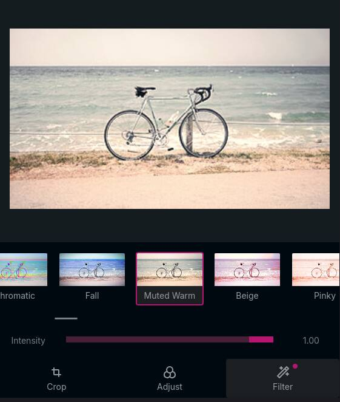
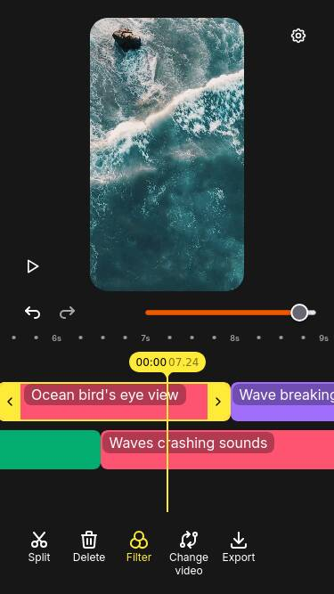

<h1 align="center">
  <picture>
    <source srcset="./docs/branding/logo/white-logo.svg" media="(prefers-color-scheme: dark)" height="170">
    
  </picture>
</h1>

<p>
  <a href="https://miru.media/code-of-conduct"></a>
  <a href="https://discord.gg/mmwMvf4Pnv"></a>
</p>

[Miru](https://miru.media) is a set of modular, extensible Web platform tools and components for still image and multi-track video editing and state-of-the-art, real-time AR. Using WebGL, WebAssembly, and open source, mobile-optimized machine learning models, Miru will give people on the social web the tools to edit images and apply interactive effects to recorded video without compromising on privacy and transparency. Miru aims to provide intuitive and user-friendly UIs which developers can easily integrate into their Web apps regardless of the front-end frameworks they use.

<p align="center">
    
    
</p>

<!-- #region main -->

## Who is it for?

Web developers who wish to add lightweight media editing to their apps or websites can do so by integrating miru's photo
editor, video editor and video trimmer. These tools are exposed as custom elements which should work in apps using
vanilla JS or any major front-end framework like Vue or React.

```html
<media-trimmer id="trimmer" source="video.webm"></media-trimmer>
<button id="export" type="buton">Get trimmed video</button>
<progress id="export-progress" max="1" />

<script type="module">
  // assuming a bundler like Vite is used
  import 'media-trimmer'

  const trimmer = document.getElementById('trimmer')
  const button = document.getElementById('export')
  const progress = document.getElementById('export-progress')

  // save the trimmed video to a file
  button.addEventListener('click', async () => {
    const blob = await trimmer.toBlob()

    const anchor = document.createElement('a')
    const blobUrl = URL.createObjectURL(blob)

    anchor.href = blobUrl
    anchor.target = '_blank'
    anchor.download = 'trimmed.webm'
    anchor.dispatchEvent(new MouseEvent('click'))
    URL.revokeObjectURL(blobUrl)
  })

  // display the trimming progress
  trimmer.addEventListener('progress', (event) => (progress.value = event.detail.progress))
</script>
```

## Roadmap

We've outlined our development plans in our [roadmap here](https://miru.media/roadmap).

## Packages

Miru's tools are published to npm as the following packages:

| npm package                                                              | Description                                                      | Docs                              |
| ------------------------------------------------------------------------ | ---------------------------------------------------------------- | --------------------------------- |
| [`webgl-media-editor`](https://www.npmjs.com/package/webgl-media-editor) | A simple image editor with cropping, rotation, and WebGL filters | [docs](/guide/webgl-media-editor) |
| [`media-trimmer`](https://www.npmjs.com/package/media-trimmer)           | A simple MP4 video trimmer using the WebCodecs API               | [docs](/guide/media-trimmer)      |
| [`webgl-effects`](https://www.npmjs.com/package/webgl-effects)           | A library for applying filters and effects to images with WebGL2 |                                   |
| [`webgl-video-editor`](https://www.npmjs.com/package/video-editor)       | A mobile-friendly, multi-track video editor with WebGL effects   | [docs](/guide/webgl-video-editor) |

<!-- #endregion main -->

## Contributing

Read our [code of conduct](./CODE_OF_CONDUCT.md) and [contributing guide](./CONTRIBUTING.md) to learn how you can contribute.

## Funding

This project is funded through [NGI Zero Core](https://nlnet.nl/core), a fund established by [NLnet](https://nlnet.nl) with financial support from the European Commission's [Next Generation Internet](https://ngi.eu) program. Learn more at the [NLnet project page](https://nlnet.nl/project/Miru).

<a href="https://nlnet.nl">
  <picture>
    <source srcset="https://nlnet.nl/logo/banner-diapositive.svg" style="width:12.5rem" media="(prefers-color-scheme: dark)" />
    
  </picture>
</a>
<a href="https://nlnet.nl/core">
  <picture>
    <source srcset="https://nlnet.nl/image/logos/NGI0_tag_white_mono.svg" style="width:12.5rem" media="(prefers-color-scheme: dark)" />
    
  </picture>
</a>
