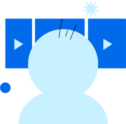

  

    

      

        <h1 class="text-center mb-4">Projects</h1>
      

      <ClientOnly>
        <ul class="project-list">
          <li v-for="{ id, name, createdAt } of projects" :key="id" class="project-list-item">
            <a :href="getDocUrl(id)" class="project-card">
              
{{ name }}

              
{{ new Date(createdAt).toLocaleString() }}

            </a>
            <button class="project-delete" @click="() => onClickDelete(id)">
              

              
{{ $t('delete') }}

            </button>
          </li>
        </ul>
      </ClientOnly>
    

    

      

        
        <button @click="() => createDoc()" class="create-button">
          

          {{ $t('create_empty_project') }}
        </button>
        <button @click="() => createDoc('Example', demoDoc)" class="create-button">
          

          {{ $t('create_example_project') }}
        </button>
      

    

  

