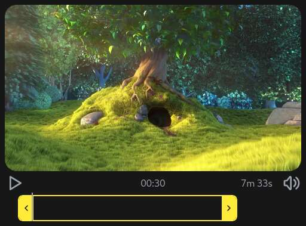

# A video trimmer in the browser



https://demo.miru.media/trim/

```sh
npm install media-trimmer
```

```js
import { trim } from 'media-trimmer'

try {
  // The input video must be a `.mp4`/`.mov` file with a video track
  // and the browser must support video encoding with the WebCodecs API
  await trim('video.mp4', {
    start: 2, //    start time in seconds
    end: 10, //     end time in seconds
    mute: false, // ignore the audio track?
  })
} catch (error) {
  alert(error)
}
```

It also comes with a Web Component UI:

```html
<!-- after importing the library, the <media-trimmer> custom element will be defined -->
<media-trimmer id="trimmer" source="video.mp4"></media-trimmer>

<button id="export" type="buton">Get trimmed video</button>

<script>
const trimmer = document.getElementById('trimmer')
const export = document.getElementById('export')

button.addEventListener('click', () => console.log(await trimmer.toBlob()))
trimmer.addEventListener('progress', (event) => console.log('progress:', event.detail.progress))
<script>
```

Powered by:

- [mp4Box.js](https://gpac.github.io/mp4box.js/)
- [mp4-muxer](https://gpac.github.io/mp4box.js/)
- [WebCodecs API](https://developer.mozilla.org/en-US/docs/Web/API/WebCodecs_API)

## Roadmap

- [ ] Lossless trimming
- [ ] Bitrate/filesize controls
- [ ] Webm support
- [ ] Color profile preservation
- [ ] Increased browser and codec support via [LibAVJS-WebCodecs-Polyfill](https://github.com/ennuicastr/libavjs-webcodecs-polyfill)

## Funding

This project is funded through [NGI Zero Core](https://nlnet.nl/core), a fund established by [NLnet](https://nlnet.nl) with financial support from the European Commission's [Next Generation Internet](https://ngi.eu) program. Learn more at the [NLnet project page](https://nlnet.nl/project/Miru).

[](https://nlnet.nl)
[](https://nlnet.nl/core)
